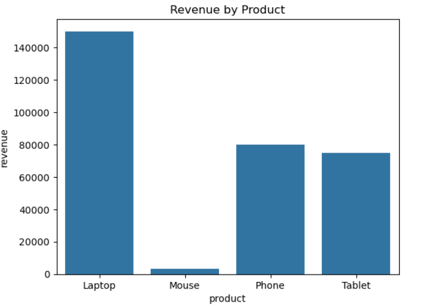
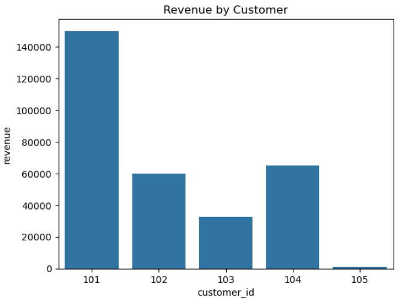
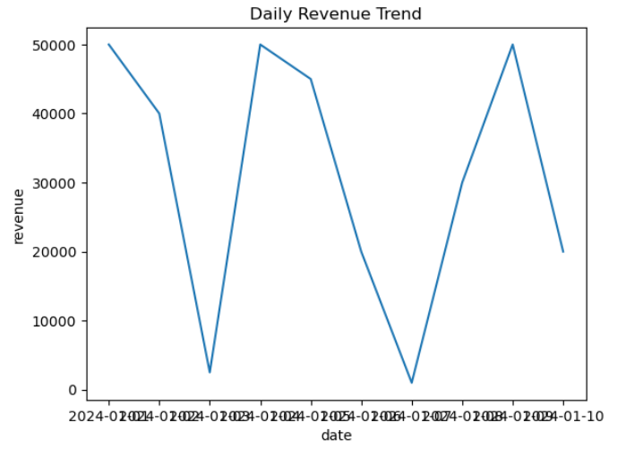

 Sales Dashboard Analysis

This project analyzes sales data using Python, Pandas, and Seaborn to generate insights and visualizations.

Project Overview

- Created a sales dataset with orders, customers, products, quantity, and price
- Calculated total revenue
- Analyzed revenue by product and customer
- Identified top-performing products and customers
- Visualized trends using graphs

 Technologies Used

- Python
- Pandas
- Matplotlib
- Seaborn

Key Insights

- Laptop generated the highest revenue
- Customer 101 is the top customer
- Daily revenue shows fluctuating trends

Visualizations

- Revenue by Product (Bar Chart)
- Revenue by Customer (Bar Chart)
- Daily Revenue Trend (Line Chart)

File Included

- "sales_dashboard_analysis.ipynb" → Complete analysis notebook

Future Improvements

- Add real dataset
- Build interactive dashboard using Power BI / Streamlit
- Add more advanced analytics

 ## 📊 Visual Output

### Product Analysis

### Customer Analysis

### Sales Trend

